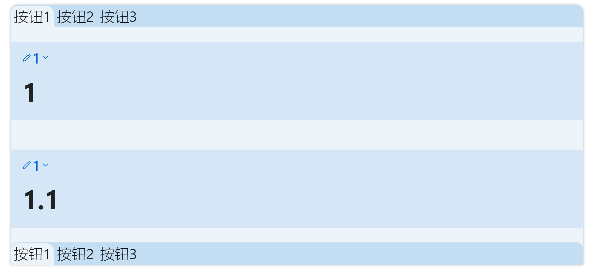

## 这是一个Obsidian笔记软件的插件
可以通过代码块嵌入多个标签页。

⚠️注意：使用`![[link]]` 这种嵌入显示时不要引用到自身，引用到自身可能会造成obsidian死循环卡死。如果出现此情况需要打开本地资源管理器把文件里面引用自身的内容删除。


## 例1，tab按钮在上

效果: 

 
 代码块语法：
````md
```minitabs
tabs
`按钮1` `按钮2` `可以一直写下去……` 
===
第一个按钮对应的页面
===
按钮二对应的页面
===
按钮三对应的页面
```
````

## 例2，tab按钮在下

效果: 

 
 代码块语法：
````md
```minitabs
tabsBottom
`按钮1` `按钮2` `可以一直写下去……` 
===
第一个按钮对应的页面
===
按钮二对应的页面
===
按钮三对应的页面
```
````


## 上下tab按钮相互套娃


效果: 

 

 代码块语法：

``````md
`````minitabs
tabs
`按钮1` `按钮2` `按钮3` 
---
>[!Note]+ 1
># 1
````minitabs
tabsBottom
`按钮1` `按钮2` `按钮3` 
===
>[!Note]+ 1
># 1.1
===
>[!Note]+ 1
># 1.2
===
>[!Note]+ 1
># 1.3
````
---
>[!Note]+ 1
># 2
````minitabs
tabsBottom
`按钮1` `按钮2` `按钮3` 
===
>[!Note]+ 1
># 2.1
===
>[!Note]+ 1
># 2.2
===
>[!Note]+ 1
># 2.3
````
---
>[!Note]+ 1
># 3
````minitabs
tabsBottom
`按钮3.1` `按钮3.2` `按钮3.3` 
===
>[!Note]+ 1
># 3.1
===
>[!Note]+ 1
># 3.2
===
>[!Note]+ 1
># 3.3
````
`````
``````


## 四象限视图

四象限视图本质上是一个分栏视图，通过创建一个2\*2的视图实现。所以可以写成2\*1或2\*N作为两列N行的分栏视图。

效果: 


 代码块语法：

 `````md
````minitabs
fourQuadrant
---
### 不紧急但重要⭐⭐⭐
- [ ] 呆呆
---
### 紧急且重要⭐⭐⭐⭐
- [ ] 呆呆
---
### 不紧急不重要⭐
- [ ] 呆呆
---
### 紧急不重要⭐⭐
- [ ] 呆呆
````
 `````
